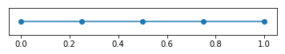

# Fundamental session: 1D Algebra Equation

In this session, the discretization of the algebra equation 
\begin{equation}
  u = f,
\end{equation}
where $f=1$ will be visulized.  

It is clear that for the algebra equation, the integrate by parts is not required. Such that there is no difference between so-called "strong form" and "weak form". It will be  
\begin{equation}
  \int_{\Omega} u v dx = \int_{\Omega} f v dx.
\end{equation}

The unknown $u$ can be approximated by a global piece-wise shape function $\phi_i (x)$ such that 
\begin{equation}
  u_h(x) = \sum_{j=1}^{N} U_j \phi_j(x),
\end{equation}
where $u_h$ indicates that this approximatation is based on the discretization with mesh size $h$ and $U_j$ is the dof, namely the nodal value of the unkown.

## Finite element space
For a standard P1 interval element defined on $\xi \in [-1, 1]$, the base function is 
\begin{equation}
  \begin{aligned}
    N_1 &= \frac{1}{2} (1-\xi) \\\\ 
    N_2 &= \frac{1}{2} (1+\xi).
  \end{aligned}
\end{equation}

\begin{equation}
  x^e(\xi) = \sum_{k=1}^2 x_k^eN_k(\xi) = x_1^e * \frac{1}{2} (1-\xi) + x_2^e * \frac{1}{2} (1+\xi),
\end{equation}
where $x_1^e$ and $x_2^e$ are the coordinates of two vortex of the interval element in physical space.


```python
%matplotlib inline
from dolfin import *

mesh = UnitIntervalMesh(4)
plot(mesh)
```


    [<matplotlib.lines.Line2D at 0x7f673c47b400>]





## Jacobian in 1D
\begin{equation}
  J(\xi) = \frac{dx}{d \xi} = \sum_{k=1}^2 x^e_j \frac{d N_j}{d \xi} = \frac{1}{2} (x^e_2 - x^e_1),
\end{equation}

For a give 4 cells discretization figured out below, $x^e_2 - x^e_1 = \frac{1}{4}$, such that 
\begin{equation}
  J(\xi) = \frac{1}{8}.
\end{equation}

## Discretization
In the Galerkin method discretization, the same piece-wise approximation $\phi$ is selected as the weighted function $v_h$, marked as $\hat{\phi}$ to distinguish from the shape trial function. 
\begin{equation}
  v_h = \hat{\phi}_i, \ \text{for} \ i= 1, 2, 3... N,
\end{equation}

With this $N$ times selection of arbitrary test function, we can summarize $N$ linear eqatuion for $N$ unknowns.

\begin{equation}
  \sum_{j=1}^{N} U_j \int_{\Omega} \phi_j \hat{\phi_i} dx = \int_{\Omega} f \hat{\phi}_i dx, \ \text{for} \ i= 1, 2, 3... N.
\end{equation}

## Matrix formulation
\begin{equation}
  [A] \{U\} = \{b\},
\end{equation}

where 
\begin{equation}
    \begin{aligned}
        A_{ij} &= \int_{\Omega} \phi_j \hat{\phi_i} dx,  \\\\    
        b_i &= \int_{\Omega} f \hat{\phi_i} dx.
    \end{aligned}
\end{equation}


## Abstract formulation
In abstract formalism,
\begin{equation}
  \begin{aligned}
    A_{ij} &= a(\phi_j,\hat{\phi}_i), \quad i,j = 1,2,...,N, \\\\  
    b_i &= L(\hat{\phi}_i).
  \end{aligned}
\end{equation}


```python
P = FiniteElement('P', interval, 1)
Q = FunctionSpace(mesh, P)

# Define test and trial functions
u = TrialFunction(Q)
v = TestFunction(Q)

f = Constant(1.0)

# Define variational problem
a = u*v*dx  
L = f*v*dx
```

## Construction of element stiffness matrix?
To calculate the components of the element matrix, 
\begin{equation}
  \begin{aligned}
    A^e_{l,m} &= \int_{\Omega^e} \phi_j \hat{\phi_i} dx = \int_{\Omega^s} N_m (\xi) N_l (\xi) det J(\xi) d \xi, \\\\ 
    b^e_m &= \int_{\Omega^e} f \hat{\phi_i} dx = \int_{\Omega^s} f N_l (\xi) det J(\xi) d \xi .
  \end{aligned}
\end{equation}
the [Gaussian quadrature](https://en.wikipedia.org/wiki/Gaussian_quadrature) 
\begin{equation}
  \int_{-1}^{1} f(x) dx \approx \sum_{i=1}^n w_i f(x_i),
\end{equation}
will be used, where the $x_i$ is the quadrature points and the $w_i$ are the weights. In 1D problem, the quadrature points will be $\pm \frac{1}{\sqrt 3}$ and weights will be $w_1 = w_2 = 1$.
Such that 
\begin{equation}
  \begin{aligned}
    A^e_{1,1} &=  \int_{\Omega^s} N_1(\xi) N_1(\xi) det J(\xi) d \xi = \frac{1}{8} \int_{-1}^{1} \frac{1}{2}(1 - \xi) \frac{1}{2} (1 - \xi) d \xi = \frac{1}{12}, \\\\ 
    A^e_{1,2} = A^e_{2,1} &=  \int_{\Omega^s} N_1(\xi) N_2(\xi) det J(\xi) d \xi = \frac{1}{8} \int_{-1}^{1} \frac{1}{2}(1 - \xi) \frac{1}{2} (1 + \xi) d \xi = \frac{1}{24} \\\\ 
    A^e_{2,2} &= \int_{\Omega^s} N_2(\xi) N_2(\xi) det J(\xi) d \xi = \frac{1}{8} \int_{-1}^{1} \frac{1}{2}(1 + \xi) \frac{1}{2} (1 + \xi) d \xi = \frac{1}{12}.
  \end{aligned}
\end{equation}

\begin{equation}
  A^e = 
  \left[
  \begin{matrix}
    \frac{1}{12} & \frac{1}{24} \\\\  
    \frac{1}{24} & \frac{1}{12}
  \end{matrix}
  \right] = 
  \left[
  \begin{matrix}
    0.08333333 & 0.04166667 \\\\ 
    0.04166667 & 0.08333333 
  \end{matrix}
  \right]
\end{equation}


```python
# using element index 1 (for example) to show the element matrix 
a_e = assemble_local(a, Cell(mesh, 1))
print(a_e)
```

    [[0.08333333 0.04166667]
     [0.04166667 0.08333333]]


and 
\begin{equation}
  \begin{aligned}
    b^e_1 &=  \int_{\Omega^s} f N_1(\xi) det J(\xi) d \xi = \frac{1}{8} \int_{-1}^{1} \frac{1}{2} (1 - \xi) d \xi = \frac{1}{8}, \\\\ 
    b^e_2 &=  \int_{\Omega^s} f N_2(\xi) det J(\xi) d \xi = \frac{1}{8} \int_{-1}^{1} \frac{1}{2} (1 + \xi) d \xi = \frac{1}{8}.
  \end{aligned}
\end{equation}
\begin{equation}
  b^e = 
  \left[
  \begin{matrix}
    \frac{1}{8} \\\\ 
    \frac{1}{8}
  \end{matrix}
  \right] = 
  \left[
  \begin{matrix}
    0.125 \\\\ 
    0.125
  \end{matrix}
  \right]
\end{equation}


```python
b_e = assemble_local(L, Cell(mesh,1))
print(b_e.reshape(-1,1))
```

    [[0.125]
     [0.125]]


## Construct of the complete matrix


```python
A, b = assemble_system(a, L, keep_diagonal=True)
print(A.array())
```

    [[0.08333333 0.04166667 0.         0.         0.        ]
     [0.04166667 0.16666667 0.04166667 0.         0.        ]
     [0.         0.04166667 0.16666667 0.04166667 0.        ]
     [0.         0.         0.04166667 0.16666667 0.04166667]
     [0.         0.         0.         0.04166667 0.08333333]]


```python
print(b.get_local().reshape(-1,1))
```

    [[0.125]
     [0.25 ]
     [0.25 ]
     [0.25 ]
     [0.125]]


```python
u = Function(Q)
solve(A, u.vector(), b)
print(u.vector().get_local())
```

    [1. 1. 1. 1. 1.]

